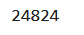

# Amazon Vine Analysis with Big Data: Analyzing Difference in Reviews using Spark

## Overview of Project

### Purpose
The purpose of this project is to analyze Amazon reviews written by members of the paid Amazon Vine program which is a service that allows manufacturers and publishers to receive reviews for their products via paying a small fee to Amazon and provides products to Vine members who are required to publish a review. The dataset in question that is being analyzed is for automotive products. The project involves using an ETL process to extract the dataset, transform the data, connect to an AWS RDS instance for big data, and load the transformed data into a local interface of pgAdmin.

The dataset includes columns for national marketplace, customer ID, review ID, product ID, product parent, product title, product category, rating by number of stars, number of helpful votes, number of total votes, whether or not it is part of the Vine program, whether or not it is a verified purchase, review headline, review body, and review date.

## Results

* After filtering for total votes greater than 20 and where helpful votes are more than half of the total votes, there is a total of 24,824 reviews for automotive products. There are 82 Vine reviews for automotive products and 24,742 non-Vine reviews for automotive products. The first image above is the top twenty rows of the resulting dataframe after filtering. The second image is the calculated total number of reviews after filtering. The third image is the calculated total number of Vine paid reviews after filtering. The fourth image is the calculated total number of non-Vine and unpaid reviews after filtering.

* In total, there were 12,840 reviews that had five stars for automotive products. There are 33 Vine reviews that were five stars for automotive products and there were 12,807 non-Vine reviews that were five stars for automotive products. The first image above is the calculated total number of reviews after filtering that were five stars. The second image above is the calculated total number of reviews after filtering that were five stars and Vine paid reviews. The third image above is the calculated total number of reviews after filtering that were five stars and non-Vine and unpaid reviews.

* 40.24% of Vine reviews for automotive products after filtering were five stars and 51.76% of non-View reviews for automotive products after filtering were five stars. The first image above is the calculated percentage of Vine reviews that were five stars over the total number of Vine reviews. The second image above is the calculated percentage of non-Vine reviews that were five stars over the total number of non-Vine reviews.

## Summary

Positivity bias is a bias by people to report only their positive attitudes especially in a public setting. It appears that there is substantial tendency by reviewers to provide positive reviews given that over half of the non-paid reviews were five stars which is even larger in percentage than paid reviews which had been required on the basis of the Vine program. Given that non-paid reviews are voluntary while paid reviews were required then there could be a response bias towards reporting positive opinions for ordinary people.

One additional analysis that could be done to support this view is to look at the distribution of stars for reviews to note how many reviews were also other high reviews such as four stars. This is given that the distinction between four and five stars is highly subjective and could both denote a highly positive experience so if the two are a combined category and there is little difference in percentages between Vine and non-Vine reviews for this category then maybe it could be surmised there is no positivity bias. 

Additionally, another analysis that could be conducted is to determine how many purchases had been made in total versus how many reviews were present. Then, it can be determined what percentage of purchasers left reviews as well as what percentage of reviewers left reviews with each number of stars. If only a small number of purchasers had left reviews then it can be surmised that there is a strong tendency to leave positive reviews when volunteering their opinions.
